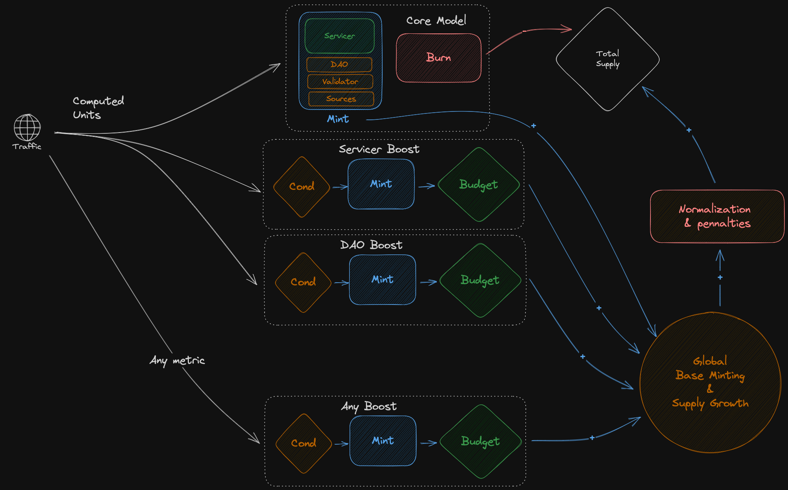

# Tokenomics Models <!-- omit in toc -->

This folder contains three different tokenomic models:

- [Shane](#shane)
- [MINT-V2](#mint-v2)
- [Token Logic Modules](#token-logic-modules)
  - [Core Model](#core-model)
  - [Boosts](#boosts)

## Shane

A python version of the final [spreadsheet model from Shane](https://docs.google.com/spreadsheets/d/1-_G8VCQ7WbytNmps_N6LhQJatPN3CvV6z2_e0bN9cC0/edit).

The model implements the initial concept of Token Logic Modules (TLMs).

## MINT-V2

This is an upgrade to the [MINT model](https://forum.pokt.network/t/mint-incentivizing-network-transformation-mint/4522) featuring non-linear parameter modulation and a normalization mechanic based on the entropy concept [described here](https://forum.pokt.network/t/v1-how-to-enforce-fairness-and-decentralization-a-first-approach/3992).

## Token Logic Modules

_tl;dr Independent decoupled tokenomic modules._

This is an composed version of the two models above. While more complex, it enables the implementation of arbitrary politics that can be applied or removed without cross-talk. For example, if we want to increase the DAO income by means of over-minting, we don't need to change the base minting, increase the DAO take and reduce the Validators, Sources and Servicers take, instead, we would only increase the DAO boost module (or add a new one).

The concept of the TLM is described in the following figure:

The TLM model is composed of a single `Core Model` and multiple `Boosts`.

### Core Model

The `Core Model` represents the ultimate tokenomics of the network, meaning, self-sustained economy with `mint == burn` (or very little supply growth/attrition). This module will mint proportional to the burn and divide the rewards among actors following a share table similar to Morse.

### Boosts

The `Boosts` (DAO, Validator, Supplier, Source) are modules that provide extra minting to a given actor. A module has the following characteristics:

- _Recipient_ : The `network actor` that will receive the boost. A TLM can only affect a single actor.
- _Condition_ : A set of thresholds over a given network parameter that determine whether to apply or not the TLM.
- _Minting_ : The logic required to produce the minting. This function can be arbitrary, the only condition is that it should provide a value for each service in the network as return value.
- _Budget_ : The maximum amount of coins that a module can produce. This is potentially optional, but is useful to control overall minting. For example, a given module can only mint up to a given percentage of the total supply (annualized) or a fixed amount of POKT coins.

After all the TLMs are executed, the proposed minting values are processed by the `global module`. This module applies base minting values (for example a base minting of 15000 USD to all suppliers) and controls the total supply growth (a safe mechanisms to keep supply growth controlled).

Finally the minting budget is processed by the normalization and penalties module. This module takes the potential minting and strictly reduces it, this means that this module will never output more coins (in total) than the previous one. Here the service imbalance correction and under-provided minting limits are implemented.
